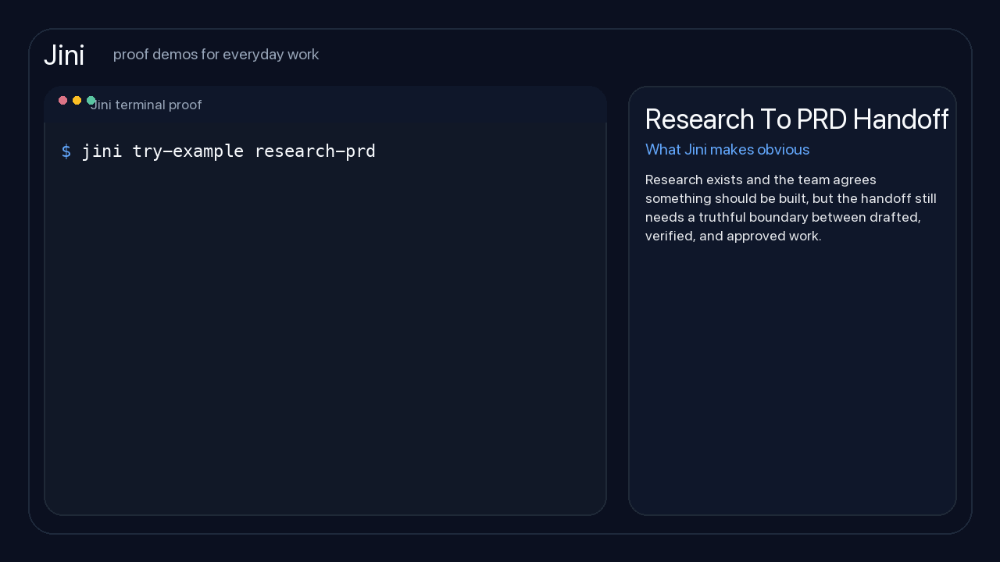

# Jini

**In plain words:** Jini helps you finish work with less rework by answering three questions:

- What is done?
- What happens next?
- What is still missing?

If you want the simplest version first, read the [Simple Guide](./docs/simple.md).

If you want the smallest grouped command surface first, run:

```bash
jini help
```

If AI tools feel helpful at first but messy later, Jini is built for that
messy part.

Jini is a harness orchestration CLI with an outcome layer above coding agents.

Jini helps when work moves between people, chats, docs, tickets, and tools,
and too much time gets lost to status chasing, repeated explanation, and late surprises.

For technical readers: Jini is a framework with a small protocol core for AI
work that needs durable state, approvals, evidence, memory, and portability.

It turns work from a pile of prompts, chats, docs, tickets, and tribal memory
into a governed system with:

- a tiny universal kernel
- durable state
- typed artifacts
- explicit authority
- operational realism
- cross-runtime portability
- a learning layer that improves policy without breaking safety

The operating rule is strict:

- lean beats broad when the two conflict
- simple default loops beat rich but heavy operator surfaces
- capability should grow at the edges, not by making the core fatter

The litmus test is simple: if a novice cannot reach useful output without
learning Python or internal framework jargon first, Jini is failing.

Jini is not a prompt pack. It is not a persona zoo. It is not another
engineering-only workflow library.

It is an operating substrate for work.

## Start Here

If you want the fastest proof that Jini is different, run this:

```bash
jini example research-prd
```

The important lines are:

```text
EXAMPLE Research To PRD Handoff
HEALTH ready-to-verify
STATE  awaiting_verification
NEXT   Verify
MISSING-LATER
  - Approval
TASKS
  done:       3/3
  unresolved: 0/3
```

That is the core idea in one screen: completed tasks are not the same thing as
a usable outcome.



If you want the fastest install path, run this:

```bash
pipx install --editable git+https://github.com/maridlabsai/jini.git
jini start --harness codex
jini example research-prd
```

That gives you a real `jini` command immediately, while keeping the runtime
packs and specs in the editable source checkout. It also gives beginners the
smallest safe path and power users the deeper surface through the same kernel.

For `v0.1.0`, that editable source-backed install is the supported public
distribution path. Jini still expects public runtime assets such as packs,
specs, manifests, and writable learning state to live together, so a
conventional wheel-style install is not advertised as a stable path yet.

## Bring Your Own Harness

Jini does not ask you to bet on one coding agent.

Use the harness you already trust to execute:
- Codex
- Claude Code
- GitHub Copilot
- Junie
- Kiro CLI
- Augment

Jini sits above the harness. The harness executes. Jini keeps the work,
state, artifacts, and next honest step coherent so the outcome survives
handoffs and follow-through.

```bash
jini harnesses
```

## What Gets Easier Right Away

The public core should feel useful fast. The clearest way to evaluate Jini is
through four familiar situations and the time they usually waste:

- **Meeting follow-up.** Spend less time turning scattered notes into real
  owners, follow-up, and next steps with `jini example meeting-followup`.
- **Research to PRD handoff.** Catch false “done” states before the team
  builds from an unverified draft with `jini example research-prd`.
- **Vendor selection.** Keep the rationale attached so approval does not turn
  into another debate with `jini example vendor-selection`.
- **Incident response.** Avoid a second wave of cleanup by keeping closure work
  visible after recovery with `jini example incident-response`.

Those four cover the same pattern: work looks done, but hidden follow-up still
creates delay, rework, or avoidable risk later.

The public repo also proves the same kernel can stretch into personal planning,
such as travel and budgeting, and into more formal workflows such as compliance
audits.

For a fuller walkthrough with runnable commands and sample output, see
[docs/examples.md](docs/examples.md).

## Pick The Problem That Is Costing You Time

Start with the problem that already feels familiar:

| Workflow | Use it when | Run |
| --- | --- | --- |
| **Meeting follow-up** | one meeting needs real follow-up, owners, and honest next steps | `jini example meeting-followup` |
| **Research to PRD handoff** | research exists and you need a safe build handoff | `jini example research-prd` |
| **Vendor selection** | several options look plausible and you need a choice that can move into approval and action | `jini example vendor-selection` |
| **Incident response** | the outage is over but rollback, proof, and closure still matter | `jini example incident-response` |

## Day-To-Day Value

Jini is not supposed to be impressive only in theory. It should remove daily
friction.

In normal work, that means:

- after a meeting, you know what follow-up is real and what is still missing
- before a handoff, you know whether the work can become a safe outcome
- before asking for approval, you can show the rationale and missing evidence
- after tasks are marked done, you can still see whether the pack is waiting on
  verification or approval
- after an incident, you can tell whether the system is merely stable or truly
  ready for closure

The recurring Jini command is:

```bash
jini outcome <path-to-work>
```

That one screen tells you the current state, next step, missing requirements,
and whether "done" has actually become an outcome.

## Support And Feedback

Use:

- [GitHub Issues](https://github.com/maridlabsai/jini/issues) for reproducible bugs, documentation gaps, and clear feature requests
- [GitHub Discussions](https://github.com/maridlabsai/jini/discussions) for questions, workflow design discussion, pack ideas, and adoption feedback

If you are not sure whether something is a bug or a design question, start in
Discussions.

## Public Core Boundary

Jini uses an open-core boundary that should stay easy to understand.

Free and public:

- framework code
- CLI surfaces
- protocol and schema docs
- install path
- example packs
- proof path
- tests

Paid later:

- implementation help
- onboarding workshops
- design-partner work
- premium domain or control surfaces only after repeated demand proves they are worth building
- enterprise support, integrations, and governance

What this means in practice:

- the public repo is meant to be usable on its own
- the paid path is for acceleration, customization, and enterprise trust
- the core framework should not be paywalled

## The Short Pitch

Most AI workflow systems are built around the execution medium of the moment:

- prompts
- agents
- IDE commands
- personas
- vendor-specific tools

Those systems can be useful, but they are temporary. They break when the model
changes, the team changes, the tool changes, or the domain stops looking like a
software demo.

Jini is built around what lasts:

- work
- state
- authority
- evidence
- risk
- change
- memory

That is why it can span software delivery, SaaS products, agentic AI systems,
mobile apps, websites, DevOps, startups, services firms, research, travel,
budgeting, tax, and regulated operations without changing the kernel.

## Why This Exists

Current AI systems are strong at local execution and weak at durable
coordination.

They often fail in predictable ways:

- context gets lost between sessions
- plans drift from execution
- work moves forward but the reasoning is not recorded
- approvals are implicit instead of explicit
- verification is weak or ad hoc
- operations are treated as an afterthought
- cross-tool handoffs are lossy
- regulated or high-stakes work becomes unsafe
- skill catalogs sprawl into hundreds of brittle commands

The deeper problem is architectural: most systems optimize for generating
outputs, not governing work.

Jini fixes that.

## What Jini Is

Jini is a framework with a strict semantic protocol core and a flexible
execution surface.

In practical terms, that means AI workflow orchestration with stronger state,
governance, memory, and handoff discipline than prompt-first or chat-first
systems usually provide.

It gives you:

- a canonical work object called the `WorkUnit`
- six kernel operations that cover the full life of consequential work
- semantic artifacts that hold durable state
- a Memory layer for compounding research, project, and stakeholder context
- guarded transitions instead of loose “phase complete” claims
- control packs for proof, risk, authority, cost, and resilience
- profiles that scale from solo exploration to regulated enterprise work
- extensions that model domains without mutating the core
- adapters so Claude, ChatGPT, Kiro, Windsurf, and other runtimes can operate
  on the same protocol
- a learning layer that optimizes workflow policy under hard constraints

## What Jini Is Not

Jini does not try to:

- replace source control
- replace ticketing systems
- replace observability systems
- replace databases
- replace legal, tax, medical, or operational ownership
- force every user to hand-author structured artifacts manually

Jini sits underneath those systems and gives them a common language.

## Discovery Terms

If you are evaluating Jini for search, sharing, or repository metadata, the
most accurate terms are:

- AI agents
- agentic workflows
- workflow automation
- AI workflow orchestration
- human-in-the-loop
- state machine
- LLMOps
- developer tools
- AI infrastructure
- knowledge management

These are not separate product categories inside Jini. They are the most
useful discovery terms for the problem Jini solves.

## Memory

Jini now includes a minimal Memory layer so work compounds without forcing every
run to reload raw material.

The structure is deliberately small:

- `knowledge/`
- `projects/`
- `people/`

Use it like this:

- `knowledge/` stores durable facts, principles, glossaries, and evergreen summaries
- `projects/` stores the compounding unit of active work
- `people/` stores concise stakeholder dossiers and review preferences

The rule is simple:

- Memory stores source material and reusable working context
- Jini artifacts store canonical state

## The Core Idea

The system has to survive:

- model churn
- vendor churn
- workflow churn
- org churn
- domain expansion
- scale changes from solo builder to enterprise team

To do that, the kernel must stay tiny and the surface must stay practical.

Jini’s design rule is simple:

If a new domain requires a new kernel operation, the system is broken.

## The Six Kernel Operations

These are the only universal operations in the protocol.

### `Scope`

Turn an ask into a coherent unit of work.

Typical outputs:

- `Brief`
- initial `Assumptions`
- scope boundaries


### `Probe`

Pressure-test assumptions, contradictions, risk, trust, economics, and
reversibility.

Typical outputs:

- updated `Assumptions`
- identified risks
- unresolved questions


### `Model`

Shape the work into boundaries, workflows, contracts, entities, dependencies,
and options.

Typical outputs:

- `Spec`
- option structures
- dependency models

### `Decide`

Choose a path, bind responsibility, define acceptance, and set rollback intent
when needed.

Typical outputs:

- `Decision`
- `Plan`
- `Tasks`
- `Approval` when required


### `Make`

Produce the thing: software, product flow, filing, process, research output,
runbook, service change, or operational response.

Typical outputs:

- realized target artifact or change
- updated task state
- evidence inputs


### `Verify`

Validate evidence, authorize transitions, release or submit when allowed, and
reopen work when reality disagrees.

Typical outputs:

- `Evidence`
- `Approval`
- `Runbook` or `Submission` when relevant


These six names are intentionally short. They are meant to feel more like
commands than process jargon.

## Why Jini

`Jini` is now the canonical platform name.

Why this name:

- ancient and compact
- associated with wisdom, strategy, and adaptive intelligence
- short enough to feel like a real command surface instead of a standards body

Jini is the only canonical platform and protocol name.

## The Canonical Work Object

Everything in Jini centers on a `WorkUnit`.

A `WorkUnit` is the aggregate root for a piece of consequential work. It keeps:

- identity
- lifecycle state
- active profile
- active extensions
- branch lineage
- owners and approvers
- operator and rollback authority
- linked artifacts
- event history

Nothing canonical exists outside a `WorkUnit`.

That matters because most current AI systems are stateless at the exact point
where serious work becomes stateful.

## The Artifact System

Prompts are not the source of truth. Artifacts are.

Jini uses typed semantic artifacts so the system can outlive a single chat,
agent, or runtime.

### Core Artifacts

- `Brief`
- `Assumptions`
- `Decision`
- `Spec`
- `Plan`
- `Tasks`
- `Evidence`
- `Approval`
- `Retro`

### Operational And Domain Artifacts

- `Runbook`
- `Dependency`
- `Signals`
- `Rollback`
- `Incident`
- `Budget`
- `Filing`
- `Submission`
- `Literature`
- `Method`
- `Sources`
- `Itinerary`
- `Scenarios`
- `Inventory`

### Learning Artifacts

- `Policy`
- `Outcome`
- `Experiment`
- `Clearance`

Each artifact is versioned, typed, revision-bound, and traceable.

That means the platform can answer questions like:

- Which evidence and workflow path justified this release?
- Which evidence validated this exact revision?
- Who approved this filing?
- Which rollback conditions were in force?
- Which policy chose this workflow path?

## The State Machine

Jini is not a document checklist. It is a guarded transition system.

The canonical work states are:

- `intake`
- `scoped`
- `probed`
- `modeled`
- `decided`
- `in_make`
- `awaiting_verification`
- `operational`
- `reopened`
- `incident`
- `retired`

Work does not move because a doc exists.

Work moves because:

- required artifacts exist
- required guards pass
- required authorities approve
- required evidence holds

This is one of the main ways Jini differs from prompt frameworks and static
skill libraries.

## The Control Packs

Jini treats governance as first-class behavior, not optional documentation.

The built-in control packs are:

- `Proof`
- `Guard`
- `Cost`
- `Authority`
- `Resilience`
- `Safeguard`

### `Proof`

Controls traceability, evidence burden, testing depth, and validation
requirements.


### `Guard`

Controls safety, privacy, abuse boundaries, and trust constraints.


### `Cost`

Controls economic discipline, resource ceilings, efficiency, and margin logic.


### `Authority`

Controls approvals, waivers, delegation, segregation of duties, and rollback
authority.


### `Resilience`

Controls observability, degraded mode, incident behavior, rollback readiness,
and runbook freshness.


### `Safeguard`

Controls the learning layer so optimization never outruns protocol safety.


## The Operating Profiles

Jini uses profiles to scale process burden and control density without changing
the kernel.

### `Explore`

For:

- ideation
- prototypes
- learning
- personal planning

Minimal burden. Fast iteration.


### `Delivery`

For:

- standard engineering work
- normal product delivery
- services work
- general planning

Balanced rigor.


### `Critical`

For:

- production changes
- major platform work
- releases with real operational consequences

Requires operational readiness and stronger verification.


### `Regulated`

For:

- healthcare
- defense
- law enforcement
- finance
- tax or legal submission

Adds traceability, stricter authority, and audit-grade evidence.


### `Incident`

For:

- outages
- mission-impacting failures
- emergency response

Overrides normal sequencing but not provenance.


## Research To Product To Build

Jini is being optimized first for two flagship problem classes:

- research in any domain
- software development in any form

The intended spine is:

`Research -> Synthesis -> Brief -> PRD -> Spec -> Plan -> Tasks -> Make -> Verify`

Research is upstream truth, PRD is the bridge, and Spec is execution truth.

## How Jini Handles Many Domains Without Breaking

Jini does not create a new kernel for each vertical.

Instead, it composes:

- profile
- extension set
- control packs
- artifact set
- process budget

That means these can all run on the same substrate:

- software engineering
- SaaS products
- agentic AI systems
- mobile apps
- websites and search
- DevOps and platform engineering
- startups and services firms
- research projects
- study and learning
- travel planning
- budgeting
- tax and regulated filing
- healthcare workflows
- defense operations
- law-enforcement evidence systems
- retail operations
- dispatch and rideshare systems
- e-signature and legal workflow systems

The system is universal because the invariants are universal, not because the
domain language is flattened.

## Extensions: How Vertical Logic Enters The System

Jini adds domain and regime constraints through extensions, not through kernel
mutation.

The extension classes are:

- `Business`
- `Modality`
- `Risk`
- `Environment`
- `Regulation`

Examples:

- SaaS = `Business:SaaS`
- mobile app = `Modality:mobile`
- healthcare = `Risk:safety-critical` + `Regulation:health-data`
- defense = `Risk:classified` + `Environment:air-gapped`
- tax filing = `Regulation:filing` + `Risk:audit-sensitive`

Each extension can add:

- required fields
- required guards
- required artifacts
- stricter evidence
- transition restrictions

It cannot silently mutate the kernel.

## Operations Are First-Class

Most systems stop at “build the feature.”

Jini continues into reality.

Operational artifacts include:

- `Dependency`
- `Signals`
- `Rollback`
- `Runbook`
- `Incident`

That lets the protocol express:

- degraded dependency behavior
- incident routing
- rollback readiness
- release health signals
- support ownership
- post-incident backfill

This is how Jini becomes credible outside demos.

## The Learning Layer

Jini includes a bounded learning layer.

The learning layer exists to optimize protocol policy, not to replace protocol
rules.

It can improve things like:

- workflow pack selection
- profile recommendation
- review depth
- subagent composition
- escalation timing
- incident routing assistance

It cannot override:

- required approvals
- forbidden transitions
- mandatory evidence
- authority scopes
- hard profile constraints

This matters because most AI systems aim straight at model intelligence.

Jini instead learns where learning is safest and most valuable:

- policy
- routing
- process budget
- workflow choice

That is a much more durable and defensible form of optimization.

## The Product Shape

Jini should be built as a stack.

### 1. Protocol Core

The semantic center:

- WorkUnit
- artifact schemas
- state machine
- authority model
- extension algebra

### 2. Execution Product

The practical surface:

- CLI
- chat commands
- resumable workspaces
- artifact harvesting
- approval and evidence flows

### 3. Workflow Packs

The application layer:

- engineering packs
- release and incident packs
- research packs
- travel packs
- filing packs
- budgeting packs

### 4. Profiles And Vertical Packs

The strictness layer:

- Explore
- Delivery
- Critical
- Regulated
- Incident

plus domain compositions.

### 5. Adapters

The portability layer:

- Claude
- ChatGPT
- Kiro
- Windsurf
- GitHub
- Jira
- Slack
- CI/CD
- future runtimes

### 6. Learning Layer

The optimization layer:

- bandits
- offline RL
- safe online policy optimization

## FAQ

### What is the kernel here?

The kernel is the smallest universal part of Jini that should stay stable
across domains.

In practice, that means things like:

- the `WorkUnit`
- the six kernel operations
- the artifact model
- the state machine
- the authority model
- extension rules

If a new use case needs a new kernel operation, the system has probably been
modeled at the wrong layer.

### What is a pack here?

A pack is an application-layer workflow package built on top of the kernel.

A pack gives a domain or problem type a practical working shape without changing
the core semantics.

Examples:

- an engineering pack
- a research-to-PRD pack
- a release or incident pack
- a filing pack

A pack should tell Jini what artifacts, flows, and execution surfaces are
useful for that type of work.

### What is a control pack?

A control pack is a governance package that changes strictness, not the kernel.

Examples include:

- `Proof`
- `Guard`
- `Authority`
- `Resilience`
- `Safeguard`

Control packs decide how much evidence, approval, safety, or rollback burden is
required for a given class of work.

### What is the "advanced set" in Jini?

The advanced set is everything that makes Jini powerful without making the
kernel bigger.

In practice, it includes:

- workflow packs
- control packs
- profiles
- memory
- execution surfaces
- artifact harvesting
- learning and RL
- adapters

The design rule is simple:

- keep the core small
- let the advanced set become comprehensive

That is how Jini aims to be flexible across many use cases without turning the
kernel into a bloated framework.

### What is an adapter?

An adapter is the portability layer between Jini semantics and a real runtime
or external system.

Examples:

- a chat/runtime adapter for Claude, ChatGPT, or Kiro
- an issue-system adapter for Jira or GitHub
- a docs adapter for Confluence
- an execution adapter for CI/CD or workspace tools

An adapter should translate Jini into the local tool surface without changing
canonical meaning.

Adapters are supposed to carry the protocol into other environments, not invent
a different protocol per tool.

### What belongs in the core versus in an adapter or pack?

Use this rule of thumb:

- if it is universal and should apply everywhere, it probably belongs in the core
- if it is domain-specific, it probably belongs in a pack
- if it is tool-specific, it probably belongs in an adapter
- if it is about strictness or governance, it probably belongs in a control pack

Jini gets stronger when those boundaries stay clear.

## Why This Can Beat Current Systems

Jini is designed to absorb the strengths of existing systems without inheriting
their ceiling.

### Compared With Prompt Packs

Prompt packs are fast, but brittle.

Jini adds:

- state
- traceability
- replay
- authority
- invalidation

### Compared With Skill Catalogs

Skill catalogs are useful, but they sprawl.

Jini keeps:

- a small kernel
- a strict lexicon
- extension algebra
- anti-entropy rules

### Compared With Engineering-Only Frameworks

Engineering frameworks often win on usability and lose on universality.

Jini can host engineering workflows while still supporting:

- regulated filing
- research
- operational response
- finance
- logistics

### Compared With Agent-Only Systems

Agent systems often optimize for orchestration and under-model governance.

Jini treats:

- authority
- evidence
- rollback
- profile strictness
- auditability

as first-class concerns.

## Concrete Examples

### Example 1: Software Spec To Ship

1. `Scope` creates the `Brief`
2. `Probe` surfaces assumptions and risk
3. `Model` produces the `Spec`
4. `Decide` creates `Decision`, `Plan`, and `Tasks`
5. `Make` implements the slice
6. `Verify` binds tests and approvals to the exact revision

This feels like a modern engineering workflow, but with stronger state.

### Example 2: Healthcare Workflow Change

Same kernel. Different profile.

- profile: `Regulated`
- packs: `Proof`, `Guard`, `Authority`, `Resilience`
- artifacts include `Spec`, `Approval`, `Signals`, `Runbook`, `Rollback`

The protocol is the same. The strictness changes.

### Example 3: Tax Filing

Still the same kernel.

- profile: `Regulated`
- artifacts include `Brief`, `Assumptions`, `Filing`, `Inventory`,
  `Evidence`, `Approval`, `Submission`
- authority and traceability are mandatory

That is how Jini escapes the engineering-only trap.

### Example 4: Research To PRD To Build

1. `Scope` creates the `Brief`
2. `Probe` records assumptions and unsupported claims
3. `Model` creates `Sources`, `Literature`, `Method`, and `Spec`
4. `Decide` creates `Decision`, `Plan`, and `Tasks`
5. `Make` renders the PRD view
6. `Verify` binds research-backed `Evidence`

This is the flagship Jini bridge from discovery into build-ready execution.

## Why The Naming Matters

The new names are short on purpose.

Systems spread when the language spreads. They harden when the language
hardens.

Names like:

- `Scope`
- `Probe`
- `Decide`
- `Make`
- `Verify`

are easier to remember, easier to expose in commands, easier to say in a
meeting, easier to teach in a demo, and easier to build into a product.

The same is true for:

- `Brief`
- `Spec`
- `Tasks`
- `Evidence`
- `Approval`
- `Runbook`
- `Signals`
- `Rollback`

This is part of making Jini feel like a platform instead of a theory.

## Why This Can Last

The protocol is designed around invariants that outlive the current AI wave.

It is not tied to:

- one model vendor
- one IDE
- one chat runtime
- one kind of team
- one industry
- one process budget

It is tied to the durable structure of consequential work.

That gives it a longer shelf life than:

- prompt-only systems
- agent persona catalogs
- static workflow libraries
- engineering-only command packs

## The Sales Narrative

If you need to explain the platform to a buyer, founder, partner, or prospect,
use this framing:

Jini is the control plane for AI-assisted work.

It gives organizations a way to:

- move faster with AI without losing governance
- standardize workflows without freezing flexibility
- coordinate humans and agents on the same state
- operate across tools without losing continuity
- support both low-ceremony and high-control work on one substrate

In one sentence:

Jini makes AI work durable, governable, and portable.

## The Founder Narrative

Most AI products today are building clever surfaces on unstable foundations.

Jini is the opposite.

It starts with the foundation:

- a strict semantic core
- a universal coordination model
- explicit authority and evidence
- operational realism
- learning that improves policy without breaking trust

That makes it bigger than a feature and stronger than a workflow pack.

It is infrastructure for the next generation of AI products.

## The Podcast Narrative

This README is intentionally written so it can be turned into a podcast episode
or launch conversation.

A clean episode structure is:

1. Why current AI workflows feel magical but brittle
2. Why prompts, personas, and skill catalogs are not enough
3. The shift from output generation to work governance
4. The six-kernel model: `Scope`, `Probe`, `Model`, `Decide`, `Make`,
   `Verify`
5. Why the `WorkUnit` matters
6. Why operations, approvals, and rollback have to be first-class
7. How one protocol can cover engineering, healthcare, research, travel, tax,
   and beyond
8. Why learning should optimize policy, not replace rules
9. Why this can become the operating system for AI-assisted work

### Suggested Podcast Hook

"AI has made it easy to generate outputs, but not to govern work. Jini is an
attempt to build the missing operating system underneath AI workflows, so they
become durable instead of disposable."

### Suggested Sales Hook

"Most AI tools help teams move fast in a single session. Jini helps them move
fast across the full life of real work, with state, proof, approvals, and
operational discipline built in."

## README Discipline

This `README.md` is the canonical top-level narrative for the platform.

It MUST stay current with any material change to:

- core vocabulary
- protocol shape
- operating profiles
- control packs
- product positioning
- benchmark or comparison documents
- repo document index

Any meaningful change to the spec set SHOULD update this README in the same
change so the public story, technical overview, and repo entry point do not
drift apart.

## How To Read This Repo

Start here for the conceptual overview.

Then read:

- [PROOF_OF_DIFFERENCE.md](./PROOF_OF_DIFFERENCE.md) — one-page explanation of what Jini keeps coherent that many AI workflows lose
- [COMMERCIAL.md](./COMMERCIAL.md) — what stays free, what gets monetized, and the staged offers that make sense for Jini
- [WHITEPAPER.md](./WHITEPAPER.md) — position paper on why Jini exists, how it evolved, and the design rules that now govern it
- [specs/canonical-names.md](./specs/canonical-names.md) — Jini canonical names
- [specs/protocol-core.md](./specs/protocol-core.md) — Jini protocol core
- [specs/work-ontology.md](./specs/work-ontology.md) — Jini work ontology
- [specs/work-state-machine.md](./specs/work-state-machine.md) — Jini work state machine
- [specs/memory-system.md](./specs/memory-system.md) — Jini memory system
- [specs/execution-routing-policy.md](./specs/execution-routing-policy.md) — Jini execution routing policy
- [specs/runtime-execution-modes.md](./specs/runtime-execution-modes.md) — Jini supervised and autonomous runtime modes
- [specs/atlassian-target-binding.md](./specs/atlassian-target-binding.md) — Jini Atlassian target binding
- [specs/artifact-schemas.md](./specs/artifact-schemas.md) — Jini artifact schemas
- [specs/extension-rules.md](./specs/extension-rules.md) — Jini extension rules
- [specs/operating-profiles.md](./specs/operating-profiles.md) — Jini operating profiles
- [specs/learning-system.md](./specs/learning-system.md) — Jini learning system
- [specs/install-packaging.md](./specs/install-packaging.md) — install manifest, curated kits, and target-shim packaging model
- [specs/personal-os.md](./specs/personal-os.md) — durable memory, tool inventory, and routine surfaces around the kernel
- [distribution/install-manifest.yaml](./distribution/install-manifest.yaml) — machine-readable bundle and target install manifest
- [distribution/adapter-registry.yaml](./distribution/adapter-registry.yaml) — machine-readable adapter registry with layers, capabilities, and maturity
- [schemas/canonical-names.json](./schemas/canonical-names.json)
- [schemas/schema-registry.json](./schemas/schema-registry.json)
- [packs/research-prd/README.md](./packs/research-prd/README.md)
- [packs/travel-plan/README.md](./packs/travel-plan/README.md)
- [knowledge/index.md](./knowledge/index.md)
- [projects/index.md](./projects/index.md)
- [people/index.md](./people/index.md)

First runnable validation command:

```bash
jini validate-pack packs/research-prd/examples/research-prd-v1
```

## Commercial

Jini core is open.

If you want help adopting it in a real repo, designing your workflow,
bootstrapping packs and adapters, or exploring a design-partner engagement, see
[COMMERCIAL.md](./COMMERCIAL.md).

Most people only need a small CLI surface:

```bash
jini start --harness codex
jini example research-prd
jini outcome /path/to/work
```

When you are ready to automate through a harness:

```bash
jini run /path/to/work --repo /path/to/repo --harness codex
```

If you want the grouped command reference, see [docs/cli.md](./docs/cli.md).
If you want the complete surface, run:

```bash
jini help --all
```

## Current Status

This repo currently contains:

- the protocol specification
- machine-readable schema files for the first WorkUnit and artifact slice
- a self-contained validator CLI
- a minimal workflow CLI for pack discovery, pack instantiation, pack
  compilation, learned bootstrapping, and pack readiness reporting
- a flagship compiled workflow pack for `research-prd`
- a second compiled workflow pack for `travel-plan`, proving the kernel can support a non-software workflow without semantic changes
- a third compiled workflow pack for `budget-cycle`, proving the same kernel can handle personal finance planning without semantic changes
- a fourth compiled workflow pack for `incident-response`, proving the same kernel can handle operations and outage-response workflows without semantic changes
- a fifth compiled workflow pack for `compliance-audit`, proving the same kernel can handle regulated review and approval-heavy workflows without semantic changes
- a sixth compiled workflow pack for `vendor-selection`, proving the same kernel can handle commercial evaluation and approval-heavy workflows without semantic changes
- compiled pack flows that now materialize task, issue, and wiki execution
  surfaces immediately after successful compilation
- a minimal Memory layer with `knowledge/`, `projects/`, and `people/`
- a validated example artifact set
- an initial CLI conformance and lifecycle test suite covering compilation,
  runtime execution, guided flow execution, local publish apply, publish-plan staging, and guarded transitions
- a `show-kpis` command that exposes the machine-readable competitive scorecard and next build actions
- a `publish-readiness` command that gives a lean public-release gate across docs, install trust, breadth, score thresholds, and lead-preservation checks on the dimensions Jini already leads
- a `validate-golden-benchmark` command that reruns a weighted golden dataset, includes a dataset digest plus current official competitor source metadata, and compares Jini against two fixed external baselines using real CLI checks instead of README-only claims
- a `get-started` command that shows one obvious trust path for beginners and a deeper inspection path for power users through the same system
- a `review-framework` command that critiques Jini itself against adoption constraints and competitor gaps instead of relying on ad hoc architectural intuition
- a `stage-framework-experiment` command that turns the strongest framework critique into a governed evolution experiment with an explicit reward model and a subtractive-first bias
- a `record-framework-outcome` command that records whether a framework experiment actually improved the target KPI
- a `backtest-framework-evolution` command that summarizes experiment outcomes and recommends the next framework focus dimension
- a `recommend-execution` command that recommends cheap, standard, or deep execution with rate-limit avoidance rules
- an initial repo-aware orchestration slice that reads repo entrypoints, worktree state, docs, and verification surfaces for execution guidance
- a `bootstrap-steering` command that creates portable workspace steering docs for product, technical, structure, and testing context
- a `show-steering` command that reports which steering docs are available and active by default
- a `repo-map` command that emits a compact workspace map for low-token delivery planning and handoff
- an `execution-checklist` command that turns pack state and repo context into a concrete next-step operator checklist
- a `compact-context` command that emits a budgeted low-token resume slice anchored to state, recent artifacts, repo actions, and stale signals
- a `bind-home` command that attaches a personal-OS home to a pack so memory, routines, and compact resumptions become part of the main execution loop
- a `stage-runtime-handoff` command that persists a target-ready runtime bundle with compact context, checklist, adapter selection, and install preview for a chosen runtime edge
- an `activate-runtime-target` command that turns a runtime handoff into a real local runtime activation bundle with install receipt, portable handoff files, and durable provenance
- an `execute-flow` command that collapses recommendation, compact reload, checklist, runtime handoff, optional runtime activation, run-pack, bounded harvest, and local publish apply into one guided execution loop
- a `catalog-packs` command that makes the implemented advanced set visible as a pack catalog instead of implicit folder structure
- a `catalog-bundles` command that leads with curated kits and demotes raw bundle detail to the advanced path instead of overwhelming first-run users
- an `operations-response-kit` that exposes the incident-response advanced surface through the same manifest-driven install lifecycle instead of making operators assemble it manually
- a `regulated-readiness-kit` that exposes the compliance-audit advanced surface through the same manifest-driven install lifecycle instead of making operators assemble it manually
- a `vendor-decision-kit` that exposes the vendor-selection advanced surface through the same manifest-driven install lifecycle instead of making operators assemble it manually
- a `run-pack` command that enforces execution routing, persists first-time consent by action category, and executes deterministic local workflow steps in supervised or autonomous mode
- `bind-atlassian` and `show-atlassian` commands that persist and inspect Jira/Confluence target bindings per pack
- an `export-tasks` command that renders a markdown execution surface from canonical `Tasks`
- a `sync-tasks` command that exports a neutral structured task payload for later adapters
- an `export-issues` command that renders Jira- or GitHub-flavored issue bundles from canonical task state
- an `export-wiki` command that renders a Confluence-flavored wiki bundle, or plain `.md` documentation files when Confluence is not available
- a `publish-issues` command that stages serialized, idempotent Jira publish plans and can apply GitHub-style local issue ledgers in one command when the adapter supports it
- a `publish-wiki` command that stages serialized wiki publish plans, automatically falls back to markdown when Confluence is unavailable, and can materialize markdown pages in one command when the adapter supports it
- an `execute-publish-plan` command that runs staged issue or wiki publish plans through a bridge command and emits a portable publication result bundle for later capture into canonical state
- an `apply-publish-plan` command that materializes GitHub issue plans and markdown wiki plans into local markdown outputs when the adapter supports local apply
- connector-ready Atlassian publish plans when a pack has a real site/project/space binding
- local-apply issue and wiki adapters for GitHub-style issue ledgers and markdown wiki outputs, plus receipts that keep portable publish state replay-safe
- a `capture-publication` command that records returned Jira issue keys and Confluence page ids back into canonical Jini state
- a `capture-output` command that records task-level execution results in canonical task state
- a guarded `advance-pack` transition command
- a `capture-evidence` command that creates or refreshes the canonical `Evidence` artifact
- a `harvest-evidence` command that runs bounded local repo verification checks, writes a runtime harvest report, and refreshes canonical `Evidence` from actual command output
- a `capture-approval` command that records explicit operational approval against the active artifact graph
- a machine-readable adapter registry plus a `show-adapters` command so portability surfaces are explicit instead of implied
- an `adapter-conformance` command that checks the adapter registry against install shims and wired export surfaces
- a `resolve-adapter` command and `adapter-matrix` view so adapter selection, fallback order, and capability coverage are explicit
- runtime-target guidance inside `recommend-execution`, `execution-checklist`, `compact-context`, and `run-pack`, so portable edge selection is part of the operator flow instead of a side document
- a first offline learning slice with `Policy`, `Outcome`, `Experiment`, and
  `Clearance` artifacts
- an initial learning-event stream plus a `show-learning-events` command for RL-facing runtime instrumentation
- a `learning-snapshot` command that summarizes runtime events into offline-evaluation-friendly aggregates, including compact-context compression ratios, automatic memory-write counts, and observed runtime-target usage
- a `routing-backtest` command that turns runtime events into offline execution-class and routing recommendations
- a `review-policy` command that turns runtime traces into guarded, non-mutating policy candidates with explicit rollout guardrails
- a `stage-policy-candidate` command that turns a pack-local policy review into a governed candidate artifact instead of an implicit suggestion
- `approve-policy-candidate` and `rollback-policy-candidate` commands that provide pack-local rollout approval, activation, and rollback for learned routing guidance
- a `bootstrap-home` command that creates a personal-OS home with
  `soul.md`, `user.md`, `tools.md`, daily memory, long-term memory, and
  local or remote routine scaffolding
- an `append-memory` command that writes low-friction durable notes into
  daily memory files
- a `memory-status` command that shows long-term memory budget usage and recommends `dream-memory` when the durable context is drifting or over-accumulating
- a `dream-memory` command that compresses daily memory into long-term
  memory with provenance while keeping the long-term surface bounded
- `list-tools` and `list-routines` commands that make the personal tool and
  routine surface explicit instead of hidden in folders
- a `run-routine` command that executes local built-ins and stages auditable
  remote routine receipts
- local `golden-benchmark`, `framework-review`, `daily-brief`, and
  `publish-readiness` routines so competitor comparison, framework evolution,
  memory, and release gating all live on the same lightweight operating surface
- home-bound recommendation, compact-context, run-pack, and harvest flows that now reuse long-term memory and append durable daily notes automatically when a pack is attached to a home
- workspace steering and compact repo-map surfaces that now feed recommendation, compact-context, and runtime-handoff flows with cheaper, more durable delivery context
- runtime handoff bundles that now carry home-bound memory, repo-aware verification targets, and target-specific install previews into a single portable execution artifact
- local runtime activation bundles that now materialize the selected target shim, handoff, checklist, repo map, and provenance into one replay-safe edge package
- a manifest-driven install lifecycle that now supports curated kits, bundle discovery, manifest digests in receipts, and doctor output that surfaces latest receipt state plus activation guidance
- target-specific install doctor checks that now surface receipt presence, shim-documentation health, and runtime activation readiness instead of only raw file presence
- a leaner install default where no-selection packaging flows now prefer the manifest starter kit instead of silently expanding to every bundle
- beginner and power-user onboarding paths that now share one kernel and one install model, with progressive disclosure instead of separate framework semantics
- an explicit runtime routing policy that prioritizes local exports, serialized publishes, and markdown fallback when SaaS targets are unavailable
- explicit runtime modes with persisted consent for `write`, `command`, and `publish` actions
- a learned bootstrap policy derived from the Iceberg benchmark exercise
- pack-local learned routing rollouts with candidate staging, approval, activation, and rollback on top of runtime traces
- a framework-evolution learning loop that can now review Jini itself, stage explicit improvement experiments, record outcomes, and backtest which changes actually improve adoption-critical KPIs

It does not yet include:

- full schema coverage for every artifact and extension type
- full repo-aware workflow orchestration across broader repo topologies
- live issue and wiki adapters beyond the new local-apply and staged publish-plan surfaces, plus richer remote execution beyond the new local runtime activation surface
- rich automatic artifact harvesting beyond the initial bounded local verification slice
- automatic memory capture across every major pack command and post-session flow by default
- real remote routine execution beyond staged receipts
- a real workflow compiler
- broad adapter and compiler conformance coverage beyond the initial CLI suite

Those are the next build steps.

For the personal-OS home model and routine semantics, see
[specs/personal-os.md](./specs/personal-os.md).

For the final framework narrative and the design rules that survived iteration,
see [WHITEPAPER.md](./WHITEPAPER.md).

## Final Position

The simplest way to understand Jini is this:

It is not another AI workflow layer.

It is a framework with a strict protocol core that AI workflows should run on.
