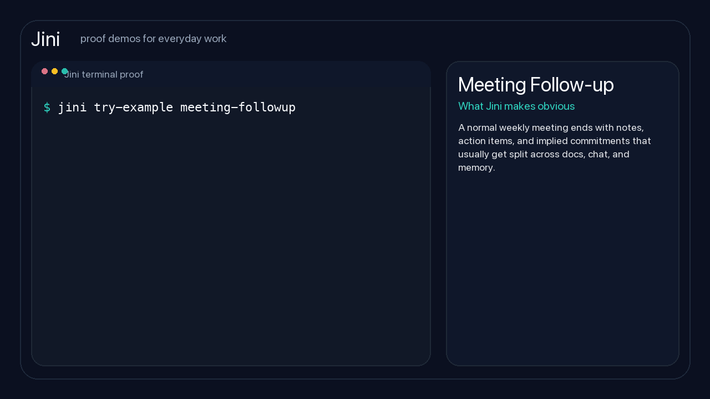
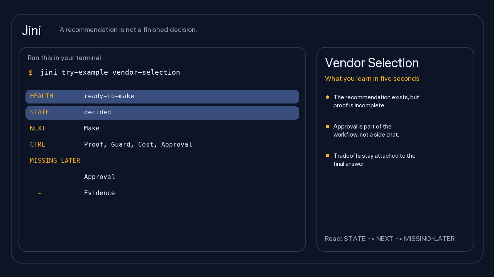
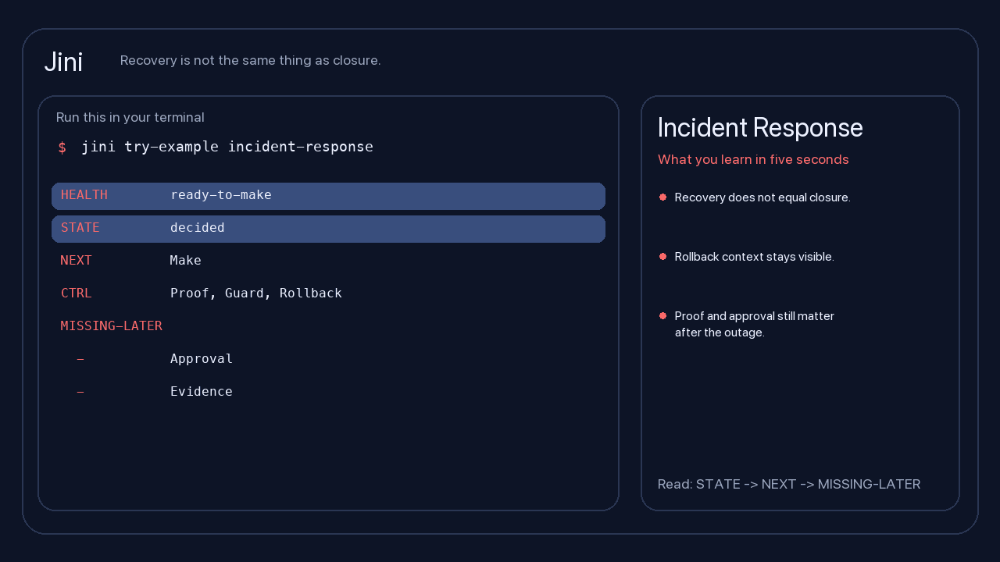

These examples should answer one practical question:

**What pain does Jini remove in work I already do?**

Do not start by trying to learn the framework. Start by finding the example
that feels uncomfortably familiar.

<div class="section-card">
  <h3>Pick the pain you have right now</h3>
  <div class="on-this-page">
    <a href="#meeting-followup">Meeting follow-up: did anything real come out of that meeting?</a>
    <a href="#research-prd">Research to PRD: is this safe to build from?</a>
    <a href="#vendor-selection">Vendor selection: can we still defend the choice later?</a>
    <a href="#incident-response">Incident response: is the incident truly closed?</a>
  </div>
</div>

## Start With The Question That Already Hurts

Use the example that matches the question you already ask in real work:

- **Meeting follow-up:** “Did that meeting produce real follow-through, or just notes?”
- **Research to PRD:** “Is this spec actually safe to build from?”
- **Vendor selection:** “If someone challenges this choice later, can we still explain it?”
- **Incident response:** “Is the incident actually closed, or are we just relieved it stopped burning?”

## How To Read One Example

Every example follows the same pattern:

1. **The question**: the thing you are trying to know
2. **What usually goes wrong**: where teams bluff past missing truth
3. **Run one command**
4. **Read the output in plain English**
5. **Use the next step instead of guessing**

## Quick Translation

When Jini prints these fields, read them like this:

- `STATE`: what stage the work is actually in right now
- `NEXT`: the next honest move, not the next wish
- `MISSING-LATER`: what will block or weaken the work if you ignore it now
- `TASKS done/unresolved`: whether work items are actually finished, not just discussed

If that translation still feels abstract, use the examples below.

<div class="workflow-jump">
  <div class="workflow-grid">
    <a class="workflow-card" href="#meeting-followup">
      <span class="workflow-meta">Meeting Follow-up</span>
      <h3>Your meeting ended, but the real follow-up is still fuzzy.</h3>
      <p>Best when decisions, owners, and missing approvals are about to get lost in notes and chat.</p>
      <code>jini try-example meeting-followup</code>
    </a>
    <a class="workflow-card" href="#research-prd">
      <span class="workflow-meta">Research To PRD</span>
      <h3>Your spec looks done, but the team still does not know if it is safe to build from.</h3>
      <p>Best for product and engineering handoffs where a polished draft is hiding missing verification.</p>
      <code>jini try-example research-prd</code>
    </a>
    <a class="workflow-card" href="#vendor-selection">
      <span class="workflow-meta">Vendor Selection</span>
      <h3>You need to recommend one option without losing the reasoning behind it.</h3>
      <p>Best for expensive decisions where the team will need to defend the choice later.</p>
      <code>jini try-example vendor-selection</code>
    </a>
    <a class="workflow-card" href="#incident-response">
      <span class="workflow-meta">Incident Response</span>
      <h3>The outage is over, but the closure work is still easy to skip.</h3>
      <p>Best for operational work where service recovery is being mistaken for true closure.</p>
      <code>jini try-example incident-response</code>
    </a>
  </div>
</div>

## 1. Meeting Follow-up {#meeting-followup}

**The question Jini answers:** “What really came out of this meeting, and
what is still fuzzy?”

<div class="example-snapshot">
  <div class="snapshot-card">
    <span class="snapshot-label">Run</span>
    <p><code>jini try-example meeting-followup</code></p>
  </div>
  <div class="snapshot-card">
    <span class="snapshot-label">Jini shows</span>
    <p>The meeting happened, but follow-through is still unresolved.</p>
  </div>
  <div class="snapshot-card">
    <span class="snapshot-label">Why it helps</span>
    <p>You stop treating notes as if they were real decisions and owned work.</p>
  </div>
</div>

**The situation:** you leave a weekly product, staff, or project meeting with
notes in one place, action items in another place, and several things that
everyone assumes are obvious.

**What usually goes wrong:** nobody can tell the difference between:

- a decision that was really made
- an action someone actually owns
- a follow-up that still needs approval
- a question that is still unresolved

**Without Jini:** the team forwards notes, people remember different versions
of the meeting, and the missing follow-up work stays invisible until it causes
delay.

**Run:**

```bash
jini try-example meeting-followup
```



**The lines that matter are:**

```text
HEALTH ready-to-make
STATE  decided
NEXT   Make
MISSING-LATER
  - Approval
  - Evidence
TASKS
  done:       0/3
  unresolved: 3/3
```

**Plain-English translation:**

- the meeting happened, but real follow-through has not started yet
- there are still 3 unresolved work items
- if this work later needs signoff or proof, that gap is already visible now

**What you do next:**

- make the unresolved items real work instead of vague follow-up
- assign owners before the meeting memory fades
- capture the missing approval or evidence path before it becomes a blocker

**Why this helps in daily work:**

Instead of forwarding notes and hoping everyone interprets them the same way,
you get one truthful follow-up surface: what is actually decided, what still
needs to be made concrete, and what will become a blocker later if nobody
captures it now.

## 2. Research To PRD Handoff {#research-prd}

**The question Jini answers:** “Is this handoff really ready, or does it only
look ready?”

<div class="example-snapshot">
  <div class="snapshot-card">
    <span class="snapshot-label">Run</span>
    <p><code>jini try-example research-prd</code></p>
  </div>
  <div class="snapshot-card">
    <span class="snapshot-label">Jini shows</span>
    <p>The draft looks complete, but it is still waiting for verification and approval.</p>
  </div>
  <div class="snapshot-card">
    <span class="snapshot-label">Why it helps</span>
    <p>You catch false confidence before engineering starts from an unverified spec.</p>
  </div>
</div>

**The situation:** research is done, the team agrees something should be built,
and the PRD or spec looks polished enough that people are tempted to call it
ready.

**What usually goes wrong:** the visible artifacts look done, but the team
still does not know whether:

- the reasoning has really been checked
- the handoff is actually safe to build from
- approval is still pending

**Without Jini:** a polished document and completed tasks create false
confidence, so engineering starts from a draft that has not really been
verified.

**Run:**

```bash
jini try-example research-prd
```


**The lines that matter are:**

```text
HEALTH ready-to-verify
STATE  awaiting_verification
NEXT   Verify
MISSING-LATER
  - Approval
TASKS
  done:       3/3
  unresolved: 0/3
EVIDENCE
  target: spec-research-prd-v1 r1
  claims: 3
  risks:  1
```

**Plain-English translation:**

- the draft looks complete, but it still needs verification
- approval is still missing
- the evidence trail is attached, so the next person is not forced to trust the document blindly

**What you do next:**

- verify the claims behind the handoff
- resolve the visible risk before build starts
- capture approval before treating the work as ready

**Why this helps in daily work:**

This is the most common Jini failure pattern: tasks are complete, the document
exists, everyone wants to move on, and nobody can cleanly answer whether the
work is actually verified. Jini makes that mismatch visible before the team
starts building from a draft that only looks finished.

## 3. Vendor Selection {#vendor-selection}

**The question Jini answers:** “Can we still defend this choice after the
meeting is over?”

<div class="example-snapshot">
  <div class="snapshot-card">
    <span class="snapshot-label">Run</span>
    <p><code>jini try-example vendor-selection</code></p>
  </div>
  <div class="snapshot-card">
    <span class="snapshot-label">Jini shows</span>
    <p>The recommendation, tradeoffs, and approval path stay attached to the choice.</p>
  </div>
  <div class="snapshot-card">
    <span class="snapshot-label">Why it helps</span>
    <p>You can explain the decision later without rebuilding the reasoning from memory.</p>
  </div>
</div>

**The situation:** several tools or vendors look reasonable and you need to
recommend one to a manager, procurement lead, or finance stakeholder.

**What usually goes wrong:** the recommendation gets separated from the tradeoffs.
Weeks later, the team remembers the conclusion but not:

- why this choice won
- what concerns were accepted
- who actually approved it

**Without Jini:** the conclusion survives, but the reasoning, accepted risks,
and approval path fade into slides, inboxes, and memory.

**Run:**

```bash
jini try-example vendor-selection
```



**The lines that matter are:**

```text
HEALTH ready-to-make
STATE  decided
NEXT   Make
CTRL   Proof, Guard, Cost, Approval
MISSING-LATER
  - Approval
  - Evidence
```

**Plain-English translation:**

- you have a direction, but not yet enough proof to treat it as settled
- approval is part of the work, not something hidden in email or a meeting
- the reasoning is expected to stay attached to the recommendation

**What you do next:**

- attach the proof behind the recommendation
- make the approval path explicit
- keep the tradeoffs with the decision instead of losing them in presentation artifacts

**Why this helps in daily work:**

When someone asks later, “Why did we choose this vendor?”, you want the answer
to be in the work itself, not in somebody’s memory. Jini makes the
recommendation, proof, and approval path part of the same flow.

## 4. Incident Response {#incident-response}

**The question Jini answers:** “Is this incident truly closed, or are we just
done talking about it?”

<div class="example-snapshot">
  <div class="snapshot-card">
    <span class="snapshot-label">Run</span>
    <p><code>jini try-example incident-response</code></p>
  </div>
  <div class="snapshot-card">
    <span class="snapshot-label">Jini shows</span>
    <p>Service recovery is not the same thing as rollback proof, review, and closure.</p>
  </div>
  <div class="snapshot-card">
    <span class="snapshot-label">Why it helps</span>
    <p>You stop calling incidents “done” before the risky follow-up work is actually finished.</p>
  </div>
</div>

**The situation:** the service is back, the immediate pressure is lower, and
everyone wants to move on.

**What usually goes wrong:** “recovered” gets confused with “closed.” The team
forgets to keep visible:

- rollback context
- evidence of what happened
- the work needed before true closure

**Without Jini:** recovery ends the conversation early, and the team quietly
skips the proof, rollback, and closure work that would matter in the next
incident review.

**Run:**

```bash
jini try-example incident-response
```



**The lines that matter are:**

```text
HEALTH ready-to-make
STATE  decided
NEXT   Make
PROF   Critical
CTRL   Proof, Guard, Rollback
MISSING-LATER
  - Approval
  - Evidence
```

**Plain-English translation:**

- the incident is no longer just chaos, but it is not truly closed either
- rollback is still a first-class concern
- proof and signoff still matter after service recovery

**What you do next:**

- keep rollback context visible while risk is still real
- capture the missing proof before calling it finished
- require honest closure instead of letting recovery masquerade as completion

**Why this helps in daily work:**

Many teams are good at firefighting and weak at closure. Jini helps keep the
uncomfortable but necessary work visible: what still needs to be proven,
whether rollback is still relevant, and whether someone can honestly say the
incident is complete.

## Breadth, After The Core Story

Once those four examples make sense, the broader public packs are easier to
understand:

- travel planning
- budget planning
- compliance audit

Those are not the best first explanation of Jini. They are proof that the same
kernel can stretch beyond one narrow class of work.

## What To Look For

If you are deciding whether Jini is relevant, ask whether one of these failure
patterns is already painful in your environment:

- the draft exists, but no one trusts the current state
- tasks are marked done, but the work is not actually verified
- ownership is implied, but not explicit
- approvals happen in chat or meetings, not in the work trail
- the next person loses the rationale behind the current state

That is the common shape Jini is designed for.

## The Smallest Useful Habit

If you adopt only one Jini habit, make it this:

```bash
jini status-pack <path-to-work>
```

Use it:

- after a meeting
- before a handoff
- before asking for approval
- after a major task set is marked done
- before declaring an incident closed

That is where Jini starts feeling useful in daily work. It gives one truthful
state surface for consequential work instead of making you infer status from
documents, tickets, chat, and memory.
